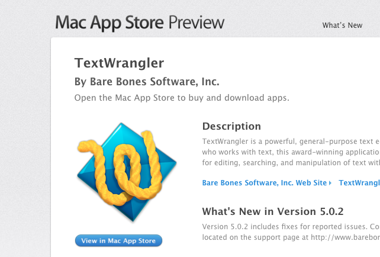
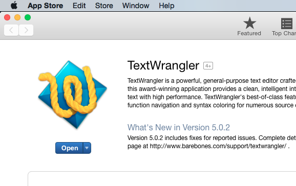
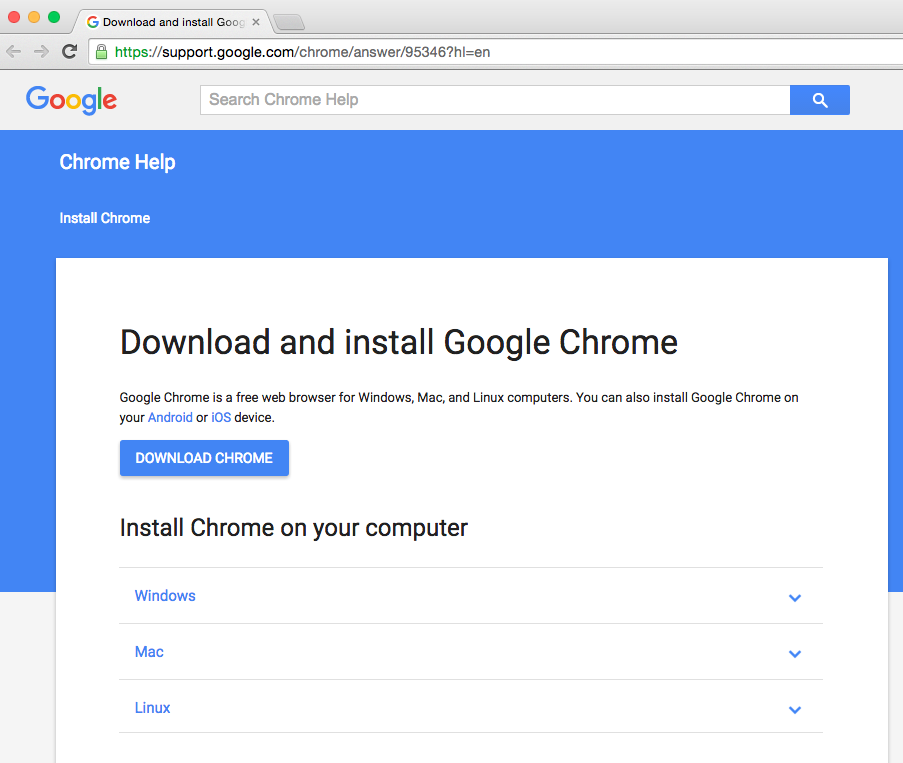
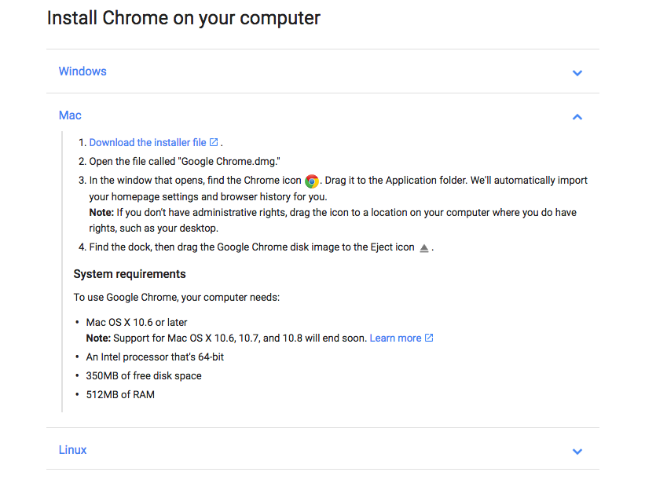

## Day One Installs
#### Overview
We are going to have you install some technologies to make your life easier as a developer, prepare you for the resources you will need during this class, and also make it easier to communicate.  
## Resource List
* You need to be an Admin on your machine.  

#### Slack
*[https://slack.com/][slack]*

Slack is a team collaboration tool similar to g-chat or AIM which developer teams can use to share code snippets, and communicate with teams.
* Signup: We will send a Slack invite to your email address so you can create your Slack account and join the SkillDistillery team
  * You will then be added to the appropriate channels.
* Download: The Mac Slack application is really convenient and easy to use (vastly superior to the browser interface), you can download it here: [https://slack.com/downloads][slackdown]  

#### Github
*[https://github.com/][gh]*

Github is a collaboration/social tool for developers which we will be using to share resources - including course material - and code throughout the program.  Github will also be a good place for you to display your work to employers down the road, so we are going to make fairly extensive use of it.  
* If you don't already have a GitHub account, create one now.
  * Go to [https://github.com/][gh]
  * Pick a username - this username will identify you to anyone looking at your code or pages on the site, so choose something appropriate.
  * Enter your email, set a password, and sign up.
* **We need your GitHub username so we can give you access to our repository.**

#### Git
*[http://git-scm.com/download/mac][gitdown]*  
* Git is version control software that we will start using later this week and througout the program
* Follow the install instructions on the link above  
  
#### Terminal
You'll be doing a lot of work in the Terminal command line.  When you open the Mac terminal app you're using the Bash command-line shell - the same shell as Linux.  Let's add the Terminal app to the Dock for quick access.
* Cmd-Space to open Spotlight search, then type "terminal".
* Drag the Terminal app (should be the Top Hit) down to the Dock bar.

#### Text Wrangler
*[https://itunes.apple.com/us/app/textwrangler/id404010395?mt=12][wrangler]*  

* If you do not already have a text editor that you prefer, we recommend downloading TextWrangler to use during Quad 1. You can click on the link above and then click the "View in Mac App Store" button, or open your App Store application and search for "TextWrangler"  
  
  
* Once you are in the App Store, click the 'Get' button below the image, and then click "Install App"  
  
  
* Now click the 'Open' button, it should open TextWrangler  

* Go to the TextWrangler menu.  Select "Install Command Line Tools..." and follow the prompts to install the *edit* command to open TextWrangler from the terminal command line.

#### Chrome
*[https://support.google.com/chrome/answer/95346?hl=en][chrome]*  

* Due to browser inconsistencies it will be helpful for all of us to be on the same client. For various reasons (dev tools and google cast included) we have chosen Google Chrome. If you do not already have Google Chrome installed, click the link above and use the Mac install instructions.  
  
  
  
  

#### Google Cast (Beta)
*[https://chrome.google.com/webstore/detail/google-cast-beta/dliochdbjfkdbacpmhlcpmleaejidimm?hl=en][cast]*  
  
* In order to do code reviews and presentations (or really just share your screen for any old reason), we are going to be using Google Cast.  The Beta version allows casting of your full desktop so we'll use that.
* To install this Chrome Extension, open Google Chrome, and go to the link above. Then Click the blue "Add Extension" button on the pane and the extension will be added to your browser.

#### Keyboard Repeat
*This one is a system preference setting*  
* The speed at which your keys wait to repeat can have a surprising effect on your productivity. We recommend that you reduce the time between repeat as much as possible.
* Open spotlight (command + spacebar) and goto 'System Preferences'
    * Click on 'keyboard'
    * Under 'Key Repeat' move the slider to 'Fast'
    * Under 'Delay Until Repeat' move the slider all the way to 'Short'  

#### Github Pages
*[https://pages.github.com/][pages]*  

* Github pages will be a quick way for us to establish a web presence and start blogging.
* Follow the steps on the link above and use your handy new Github profile to get started.
* Do you know any HTML? Get some practice by playing around with this page.  

#### Java SE Development Kit
*[http://www.oracle.com/technetwork/java/javase/downloads/jdk8-downloads-2133151.html][jdk]*

* If you did the program pre-work then you already have this installed.  Confirm by opening a terminal window and typing:
  ```bash
  java -version
  javac -version
  ```

  * If either command fails, check with your instructor for help making sure the JSDK is properly installed.

[slack]:https://slack.com/
[slackdown]:https://slack.com/downloads
[gitdown]:http://git-scm.com/download/mac
[gh]:https://github.com/
[pages]:https://pages.github.com/
[chrome]:https://support.google.com/chrome/answer/95346?hl=en
[wrangler]:https://itunes.apple.com/us/app/textwrangler/id404010395?mt=12
[cast]:https://chrome.google.com/webstore/detail/google-cast/boadgeojelhgndaghljhdicfkmllpafd?hl=en
[jdk]:http://www.oracle.com/technetwork/java/javase/downloads/jdk8-downloads-2133151.html
