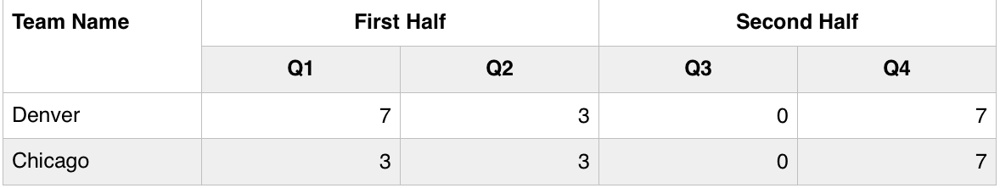
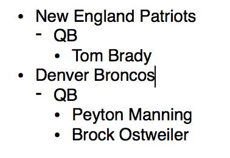

### HTML Assessment
Use the text editor of your choice to create a new file, assessment.html, with a correctly structured HTML document skeleton including a document title. Inside of this document you are going to be adding elements with their respective section headers, demonstrating your knowledge of basic HTML markup.

*An example of the finished product can be found [here](assessment_example.png). Note it is not very good looking, thats where CSS comes into play!!*
* Add a second-level section with the heading "TEXT", and under it three paragraphs.  The first paragraph should be formatted as a quotation.  The first word of each paragraph should be in bold, and the middle paragraph should be emphasized.
* Add another section header with the title "TABLE" with data to simulate a game score for the Broncos. Creating a table similar to the one shown below, using both colspan and rowspan attributes. Don't worry about styling it, just lay out a table that follows the pattern.  Give the table a header, footer, and caption.

* Create a section header with the title of "LIST". Create a list that organizes the teams by team name, position, and player. Use the default bullets that are provided with an HTML list item.

* Modify the team names above so they are links to the team home pages.  

* Locate logos for each team (Wikipedia is a good source) and use the URLs to place each element next to the team name in the list above.  Use width and/or height attributes to size it to thumbnail size.

* Add a new section with the heading "FORM".  Under it create a form whose action triggers an email to your email address. (Use a "mailto:" URL).
  * Give the form input text fields for firstname and lastname.
  * Add a drop-down options list that allows the user to select their favorite sport from a predefined list.
  * Add checkboxes indicating whether they have ever personally played/attended/coached/bet on this sport.
  * Add a radio button group indicating whether they prefer the amateur, college, or professional version.
  * Add a submit button.
  * Use br tags for basic formatting.
  Test the form and adjust form element names, action attribute, etc. as needed.

####Push your branch to github
* Navigate to this directory 'XXXXXXX'
* Use `git branch your_name` to create a branch using your name (replace your_name with your actual name)
* Use `git checkout your_name` to switch to your branch
* Use `git add fileName.html` to stage the work you've done on your assessment
* Use `git commit -m "add my assessment"` to commit your changes with a message
* Now use `git push origin your_name` to push your branch to the remote repository **DO NOT PUSH TO MASTER**
