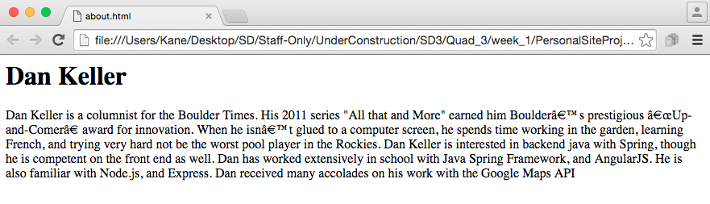

## Step 1 
### Overview
We're going to create the About page, and fill it out using Divs, H#, and p tags. `<h> 
 
`  
  
  
  
###User Stories
#####User Story #1
Create an 'index.html' file with the title 'About'. Ensure that it follows best HTML practices.

#####User Story #2
Add your name as a header.

#####User Story #3
Create a div for information about you and fill it in with your story. Answer questions like, what led you to Skill Distillery, why do you want to be a programmer, express passion and try to create a personal narrative about what led you to this moment in time.
