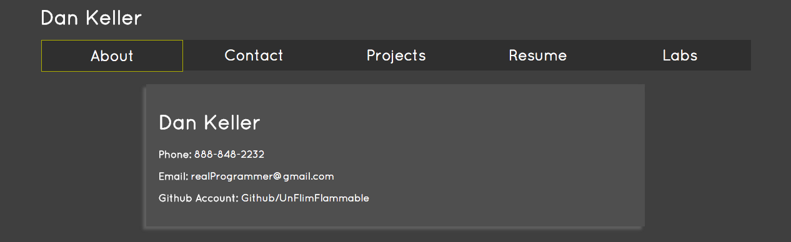

##Step 5
###Overview
Now you are going to add a proper nav bar to your site. Once complete, it should look something similar to the example below.  
  
  

###User Stories
You should only be using an external stylesheet and absolutely no inline styles.
#####User Story #1
Add position styling to your menus and page content, center it, and add a drop-shadow. Make the content background a different color than the page body background.
