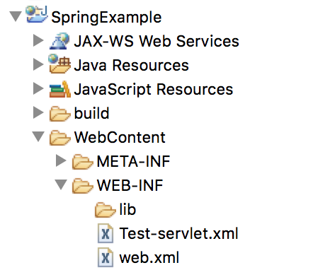
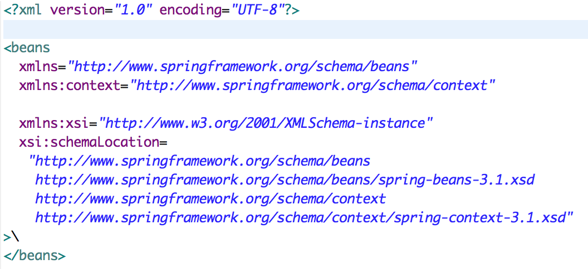
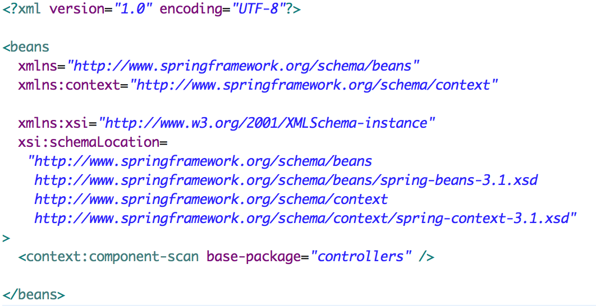

### Spring XML Configuration

#### Overview

We are going to look at configuring basic web.xml and -servlet.xml in the context of a Java dynamic web project.

#### The -servlet.xml file
The -servlet.xml file in a dynamic web project is used to instruct the program where to look for Controllers with matching URL patterns as you configured in the web.xml.

##### Step 1
Under the WebContent/WEB-INF folder create an xml file. The files name consists of two parts, the name of the servlet you are mapping to followed by "-servlet". In our case we named the servlet "Test" in the `<servlet-name>` tag shown in the web.xml, therefore, our file name would be Test-servlet.xml.

##### Step 2
Add a root element of `<beans></beans>` and include the appropriate name spaces we discussed in class.

##### Step 3
Inside of the beans element, add the context:component-scan tag. Inside of this tag add an attribute of base-package to specify in which package the program should look for @Controller annotations. In the example shown the package was named "controllers".

