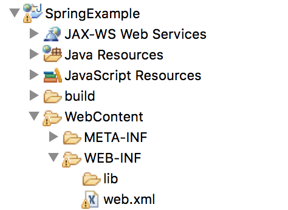
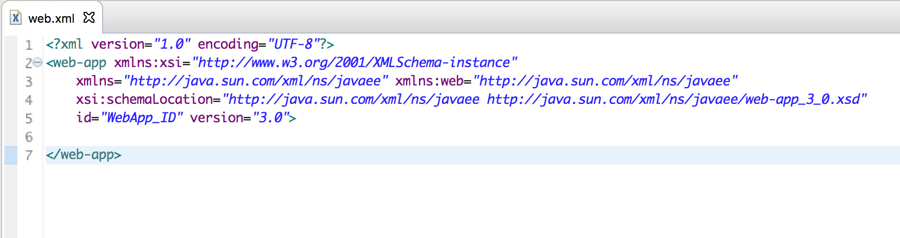
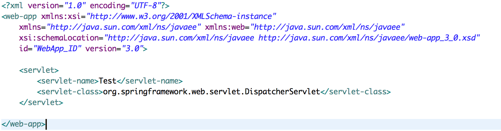
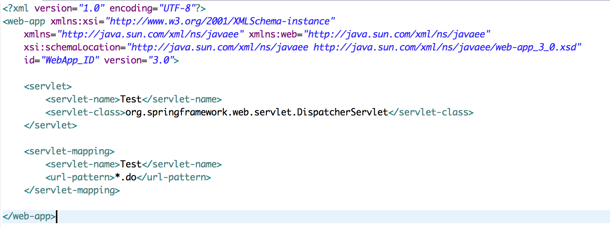

### Spring XML Configuration

#### Overview

We are going to look at configuring basic web.xml and -servlet.xml in the context of a Java dynamic web project.

#### The web.xml file
The web.xml file in a dynamic web project is used to define mappings between URL paths and the servlets that handle requests with those paths. The web.xml lives in the WebContent/WEB-INF folder and will also house the -servlet.xml.

##### Step 1
Create a web.xml file under your WebContent/WEB-INF folder.

##### Step 2
In the web.xml add a root element of `<web-app> </web-app>` with the appropriate name spaces discussed in class. Inside of this element we will define our servlets used in our application.

##### Step 3
Inside of the web-app element define a `<servlet></servlet>` element. In this element we will define a servlet name and a servlet class. This name can be any descriptive name you choose. The servlet class for our purposes will be the Spring dispatcher servlet (org.springframework.web.servlet.DispatcherServlet).

##### Step 4
Lets now add a second element in addition to the `<servlet>` called the 	`<servlet-mapping>`. Inside of this element we are going to create the `<url-pattern>` which defines the mapping from a URL path to a servlet declaration. In addition to this we again define the `<servlet-name>` define this url as a mapping to the appropriate servlet defined in step 3.

