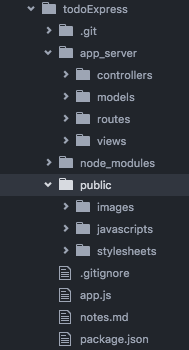

## Following a pattern
Right now we have everything living in our root directory. As you can probably tell, as your apps get larger the lack of structure can make things hard to follow. We are going to recommend you follow a specific pattern when building your node/express applications.

Our structure will allow us to follow a pattern similar to one you should be familiar with from our Java web applications. The MVC pattern (Model/View/Controller), is a standard in building web applications. All the example apps or code you see from here on out will follow this pattern.

### Current structure
Currently we have ``node_modules``, ``public``, and ``views`` folders in our root directory as well as the ``app.js`` and ``package.json`` files.

In addition up to this point we have defined all of our routes in the app.js file. We are going to strip this functionality out into route and controller files. This separation of concerns will make it much easier to find specific code instead of have a 1000 line app.js file.

### Our pattern
As I said earlier we are going to create a file system that resembles the MVC pattern. In our root directory create a folder called ``app_server``.
Create three new sub directories in ``app_server``:
* ``controllers``
* ``models``
* ``routes``

Once these have been created move your views folder from the root into the ``app_server`` directory. Your root should now contain:

```bash
app_server
node_modules
public
app.js
package.json
```

A complete project structure would look something like this:  


#### Pathing to your new view location
Because the views folder is no longer in the root directory your app will not be able to find the files to render. You are going to have to set the path to this new location in your app.js as follows:

```javascript
app.set('views', path.join(__dirname, 'app_server', 'views'));
```

There is also the issue of your defaultLayout that we set when setting handlebars as your default templating engine. There is a "feature" with the ``.create`` function where it only looks in the root directory for the views folder, regardless of if we have set the path elsewhere. To skate around this we have to explicitly path to the location of the main.handlebars layout when setting it as the default. It may look something like this:

```javascript
var handlebars = require('express-handlebars').create({defaultLayout:'../../app_server/views/layouts/main'});
```

#### Routing
Routing will be a little different than before. We are no longer defining our routes in the app.js file. Instead we are defining the routes path in a file under the routes folder, and the callback functions in a file under the controllers folder.

We are going to utilize the export functionality in the module patter to make this happen. Below is an example of two files, one (main.js) is inside of the controllers folder, the second (index.js) is in the routes folder.

```javascript
// in controllers/main.js
module.exports.index = function(req, res){
      res.render('index', {title : 'Express Todo App'});
};
```

```javascript
/* in routes/index.js */

var express = require('express');
var router = express.Router();
var ctrlMain = require('../controllers/main');

/* GET home page. */
router.get('/', ctrlMain.index);

module.exports = router;
```

In the first file we are assigning an anonymous function ``index`` to the global ``module.exports`` property. When we require this file in another location anything assigned to this property is now accessible by ``requireVarName.propertyName``. In the ``index`` file, we import the ``main.js`` file, and then assign the index function as the callback function of the `/` route.

At this point all of our routes and logic are written but the application has no way of knowing they exist. We haven't told the ``app.js`` file where to look. The last line of the ``index.js`` file is exporting all of the routes we defined in that file. Now we have to mount them using ``app.use`` in the ``app.js`` file. That code can be seen below and should be placed above out 404 and 500 error handlers.

```javascript
/* in app.js*/
app.use('/', require('./app_server/routes/index'));
```

### New project set up example
1. Create project folder
2. Enter folder, and run an npm init (creates the package.json)
3. Create a file called app.js
4. Create a folder public for all your static content
5. Create a folder called app_server(this is where mvc pattern lives)
6. Under app_server create 4 sub folders controllers/modules/routes/views
7. Under views create a folder layouts
  - views is where you store all of the partial handlebars files
  - layouts are for the general html layouts you use.
8. Run npm install on any packages you will need (express, express-handlebars or      ejs...).
9. In app.js:
  - require express
  - set app = express();
  - set the location of the views folder
  - set the location of your static content (public directory)
  - set handlebars to be your default templating engine.
  - write custom 404/500 routes
  - use app.listen to set up port 3000
10. Start setting up your routes and logic!!

### [Pattern Setup](../../labs/patternSetup.md)
