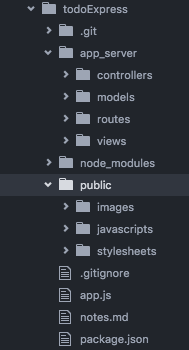

## Static express project
We are going to practice using the pattern we used today as well as using templating engines to render a few views.

1: Create your express project in accordance with the pattern we learned today. Refer to the express-pattern, New project set up example, [here](../express/express-pattern/README.md). When you are done your file structure should look something like this.

  

2: Configure the basics of your app.js file:
  * require express
  * set app = express();
  * set the location of the views folder
  * set the location of your static content (public directory)
  * set handlebars to be your default templating engine.
  * write custom 404/500 routes  * use app.listen to set up port 3000

3: Create a `app_server/routes/index.js` file. In this file add three routes:
  * '/' route for the homepage  
  * '/about' route for the about page
  * '/contact' route to a contact us page

4: Build your handlebars default view.
  * Include the title of the project displayed in an `<h1>` on every page
  * Include an image (pretend its your company logo) in the top left of every page. This image should be saved in your static `pubic` directory.

5: Build the three handlebars partials for the body of the content.
  * Your homepage should take a welcome message property that is displayed in an `<h3>` tag.
  * Your about page should display basic information about your fake company .
  * A contact me form (this doesn't need to be functional).

6: Build your three controller methods that return the appropriate view and information in their respective context object.

7: Include CSS files with all of your pages. You should access these static resources from your public directory.

### [Templating Engines](../express/templatingEngine/README.md)
