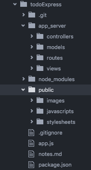
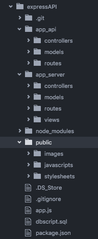

## Building an API

### Overview
Building an API is not much different than our previous node/express projects. The main difference is that we no longer have any front end to display the information.

When building your routes, you can test to make sure the proper data is returned by hitting the appropriate URI. Chrome automatically displays the returned json.

Our application will not only have an API to access information, but it will also have a simple front end that manipulates the information from the API, and displays it in the browser using jQuery. Essentially we are building two applications in one. For organizations sake we need to separate the logic for these to functionalities. To do this we will add another layer to the pattern we have been using with out node/express projects.

### Structure
We have built all of our node/express projects using the same file structure pattern.

Instead of adding our API routes and logic to the `app_server/routes/index.js` and `app_server/controllers/main.js` we are going to duplicate this file structure. At the root of project directory (same level as `app_server`), create a directory called `app_api`. This folder should contain an additional controllers, routes, models files structure.  

*Note:* we do not need a views folder due to the fact that our api has no front end.

When complete it will look something like this:

This separation of concerns allows us to take our `app_api` files, place them into any application we build and have access to our data.
