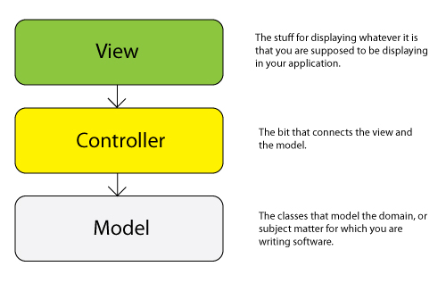
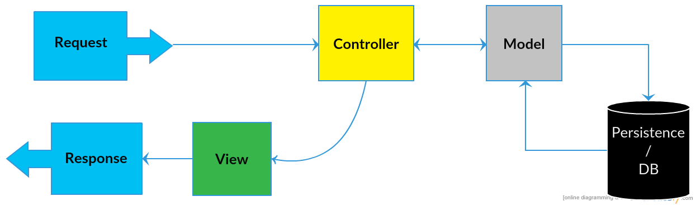

# MVC Review
* Before we start building applications with AngularJS it is worthwhile to refresh on the Model-View-Controller (MVC) pattern/archetype.
  
* Up to this point we've been following a fairly traditional implementation of MVC, the following diagram is what MVC looks like traditionally (i.e. Java SpringMVC, Express, Ruby on Rails, Django):

  
* **View**: Some kind of user interface, which displays data to users. The view's single responsibility is presentation, it doesn't know anything about the data is it given, it only display's it. If user input is provided the view sends it to the controller without modification (modification isn't the view's job).
  
* **Controller**: Communicates data to the view for the view to present to a user, and takes input from the view and sends it back to the model to update (i.e. DAO).
  
* **Model**: The data itself, or at least a blueprint of that data. Knows what the data can do, the methods associated with it (possibly including how to persist/modify it). Doesn't know anything about presentation, routes, or users (unless users are a class...but that's different).
  
* As you can see, the core objective of traditional MVC is a complete *separation of concerns*, decoupling business logic from data from presentation.
  
* Traditionally, the server side implementation of MVC pattern resembles the following:
  

  

#### Continue to [MVW with Angular](2_mvw_angular.md)