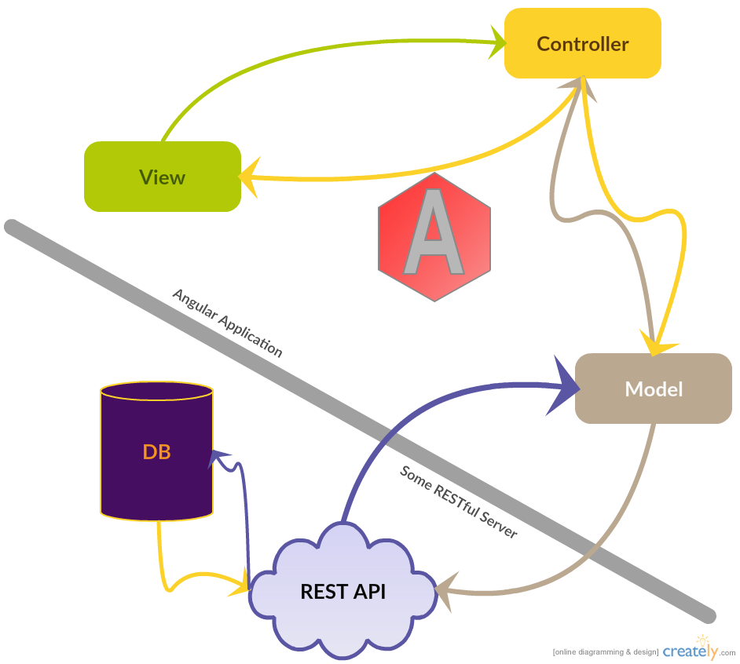
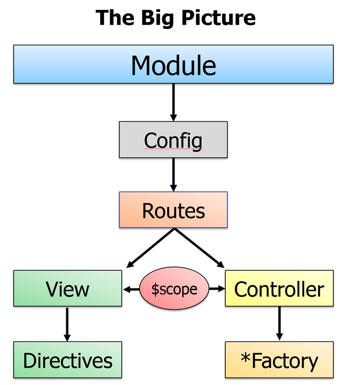

# MVW with Angular
* Angular's two way data binding makes this relationship a bit more complex. The role of the controller become more complicated, leading to some variance in the naming of the MVC pattern. It is common to see front end frameworks referred to as:
  * **MVVM**: Model, View, ViewModel
  * **MVP**: Model, View, Presenter
  * **MV***: Model, View, (Anything)
  * **MVW**: Model, View, Whatever
  
* We will continue to refer to the pattern as MVC.
  
* Angular's Controller (or ViewModel), shares the the Model with the View through the `scope` object. When an event triggers a change to the state of the Model on the View, this can be observed by the Controller which can respond to the change in state.
  

  
* Angular observes changes in Model state through a process referred to as 'dirty checking'. Each iteration of the cycle (known as the 'Digest Cycle'), Angular evaluates the previous known state of a Model against it's current state, if it has changed (become 'dirty'), it will be observed by Angular.
  
* This shared scope between View and Controller reduces the need for round trips over HTTP to dictate behavior (i.e. DOM manipulation), making Angular appear to be lightning fast and simplifying DOM manipulation.
  
### Components of Angular Applications
* Consider the following diagram:
  

  
* **Module**: A module, or sub-module is the basic building block of an Angular application. It compartmentalizes behavior and functionality. Small applications may have only one module, while large applications may consist of several.
  
* **Config**: Responsible for application configuration including but not limited to configuring templates to correspond to various URL *Routes*, authentication etc.
  
* **Scope/`$scope`**: Shared resources in the scope for both the *View* and the *Controller*. Possibly representative of Data from the *Model*, but can also contain shared behavior like functions.
  
* **View**: The currently rendered template, including annotated behaviors which utilize data from the `$scope`
  
* **Directives**: Attributes and Elements either provided by Angular or created for a specific purpose. Essentially grant you the ability to create your own application specific HTML tags/attributes.
  
* **Controller**: Responsible for pushing *Model* data to the view and providing view specific functionality. Communicates with *Model* to update persisted state of Data and retrieve updated resources.
  
* **Factory/Service**: All reuseable behavior shared between *Controllers* should be housed here. In some cases can be thought of similar to classes for the sake of dealing with the *Model*/Data. Factory and Service are largely interchangeable in terms of functionality.
  
#### Continue to [creating a module](3_modules.md)