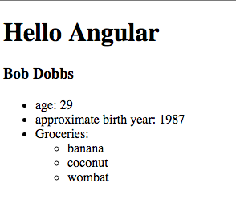

# Controllers
* A controller is assigned to a module.
  
* Controllers are created with the module method: `Module.controller('name', func)` method.
  * `'name'` is the name of the controller, and how it will be referenced in markup.
  * `func` is a factory function (frequently referred to as a constructor function), which stores all of the controllers behavior.
  
* Let's createa a new controller:
  
```html
<!DOCTYPE html>
<html ng-app="myApp">
<head>
  <title>Controllers Ng</title>
</head>
  <script src="../../angular.min.js"></script>
  <script type="text/javascript">

    var app = angular.module('myApp',[]);

    app.controller('todosController', function(){

    });

  </script>
<body>
  <h1>{{"Hello Angular"}}</h1>
</body>
</html>
```
  
* Now we have a controller!...but it doesn't do anything. In order to interact with the view we need two more things, first, we need to assign the controller a portion of the view to control with the `ngController` directive. Second, we need to use the `$scope` object to assign some data to the shared scope of the controller and the view.
  
### `ngController` directive
* `ngController` demarks an area of the view that a specific controller supports. 
  
* The controller must be assigned by name to the area it controls:
  
```html
<!DOCTYPE html>
<html ng-app="myApp">
<head>
  <title>Controllers Ng</title>
</head>
  <script src="../../angular.min.js"></script>
  <script type="text/javascript">
    var app = angular.module('myApp',[]);
  
    app.controller('todosController', function(){

    });

  </script>
<body ng-controller="todosController">
  <h1>{{"Hello Angular"}}</h1>
</body>
</html>
```
  
* Above I have added the `ngController` directive to the `<body>` element, indicating that I want my "todosController" to have control of the entire body.
  
### `$scope`
* The `$scope` service provides an object that is shared between the controller and the view. `$scope` is only available to Controller components due to the Controller's unique relationship with the view (e.g. factories, and modules do not have access to `$scope`)
  
* The `$scope` service defines *data* and *behaviors*. Data is just some values, be they static, or provided by an API. Behaviors are functions and helper methods that assist the view in presentation either invoked in bindings or directives.
  
* To gain access to the `$scope` service, we must first inject it's dependency into our controller's constructor function. This will ensure that the service is available to our controller. Dependency injection is pervasive throughout Angular.
  
* Below, we will inject the `$scope` service into the controller and print it out to have a closer look:
  
```html
<!DOCTYPE html>
<html ng-app="myApp">
<head>
  <title>Controllers Ng</title>
</head>
  <script src="../../angular.min.js"></script>
  <script type="text/javascript">
    var app = angular.module('myApp',[]);
  
    app.controller('todosController', function($scope){
      console.log($scope);
    });

  </script>
<body ng-controller="todosController">
  <h1>{{"Hello Angular"}}</h1>
</body>
</html>
```
  
* Below is the `$scope` service object printed to console. Not much going on in there at the moment, but you get an idea of the areas of responsibility that `$scope` will have.

```javascript
// $scope
$$ChildScope:null
$$childHead:null
$$childTail:null
$$listenerCount:Object
$$listeners:Object
$$nextSibling:null
$$prevSibling:null
$$watchers:Array[0]
$$watchersCount:0
$id:2
$parent:m
__proto__:m
```
  
* Let's take the responsibility of mainting the *data* away from the view and give it to the controller. We will create a new property of on the `$scope` called 'greeting', and replace `"Hello Angular"` in our view with the this property:
  
```html
<!DOCTYPE html>
<html ng-app="myApp">
<head>
  <title>Controllers Ng</title>
</head>
  <script src="../../angular.min.js"></script>
  <script type="text/javascript">
    var app = angular.module('myApp',[]);
  
    app.controller('todosController', function($scope){
      $scope.greeting = "Hello Angular";
      console.log($scope);
    });

  </script>
<body ng-controller="todosController">
  <h1>{{greeting}}</h1>
</body>
</html>
```
  
* If you run this code in a browser it should have the identical result as the hard coded version.
  
* I left the print out of the `$scope` in the controller so that we could investigate how this works. As you can see, the 'greeting' property we assigned became a property on the `$scope`:
  
```javascript
b {$$childTail: null, $$childHead: null, $$nextSibling: null, $$watchers: null, $$listeners: Object…}
$$ChildScope:null
$$childHead:null
$$childTail:null
$$listenerCount:Object
$$listeners:Object
$$nextSibling:null
$$prevSibling:null
$$watchers:Array[1]
$$watchersCount:1
$id:2
$parent:m
greeting:"Hello Angular"
__proto__:m
```
  
* As `$scope` becomes a global variable within the area of a view a controller supports, we can reference the property by name (as we did above).
  
* You can assign multiple properties of all sorts of data types to the `$scope` and access them in the view:
  
```html
<!DOCTYPE html>
<html ng-app="myApp">
<head>
  <title>Controllers Ng</title>
</head>
  <script src="../../angular.min.js"></script>
  <script type="text/javascript">
    var app = angular.module('myApp',[]);
  
    app.controller('todosController', function($scope){
      $scope.greeting = "Hello Angular";

      $scope.age = 29;
      $scope.year = 2016;
      $scope.groceryList = [
        "banana",
        "coconut",
        "wombat"
      ];
      $scope.person = {
        firstname : "Bob",
        lastname : "Dobbs"
      };
    });

  </script>
<body ng-controller="todosController">
  <h1>{{greeting}}</h1>
  <h3>{{person.firstname}} {{person.lastname}}</h3>
  <ul>
    <li>age: {{age}}</li>
    <li>approximate birth year: {{year - age}}</li>
    <li>Groceries:</li>
    <ul>
      <li>{{groceryList[0]}}</li>
      <li>{{groceryList[1]}}</li>
      <li>{{groceryList[2]}}</li>
    </ul>  
  </ul>
</body>
</html>
```
  

  
* As this slightly non-sensical example illustrates `$scope` can be used to convey any datatype to the view.
  
#### Continue to [behaviors](5_behaviors.md)

