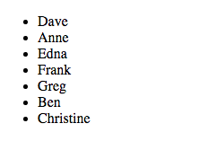

# `ngRepeat`
* The `ngRepeat` directive allows you to iterate over a collection (typically an array) of data in the view.
  
* Thing of `ngRepeat` as being similar to a `jQuery.each()`, but in Angular and with some additional functionality.
  
* To use `ngRepeat`, place it in the element you wish to repeat as an attribute, and assign it to the data with the `"element in collection"` syntax.
  
* The most beneficial aspect of how `ngRepeat` iterates over a collection, is that it not only repeats the value contained in the collection, but also surrounds it with the HTML you assign:
  
```html
<!DOCTYPE html>
<html ng-app="myApp">
<head>
  <title>Repeat Ng</title>
  <script src="../../angular.min.js"></script>
  <script type="text/javascript">
    var app = angular.module('myApp',[]);

    app.controller('todosController', function($scope){
      $scope.people = [
        "Dave",
        "Anne",
        "Edna",
        "Frank",
        "Greg",
        "Ben",
        "Christine"
      ]
    })
  </script>
</head>
<body ng-controller="todosController">
  <ul>
    <li ng-repeat="person in people">
      {{person}}
    </li>
  </ul>

</body>
</html>
```
  
* Produces:
  

  
* Notice how the list item tags were duplicated and dynamically filled with the data (`person`) from the collection (`people`). The surrounding HTML can be as complicated as you wish, you will only need to create it once and Angular will repeat it around each element in your collection.
  
#### Continue to [lab 1](7_lab1.md)