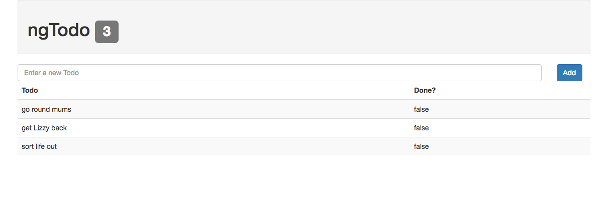

# Lab 1
* We will start building an Angular Todo application as practice. As we progress through labs we will add more functionality, and ultimately replace static content with calls to an API.
  
1: Start by creating a directory (ngtodos), and placing an index.html file within it.  
  
[Download minified AngularJS][ng], and include it in the head of your index.html.  
  
2: Create a module named "ngTodo", bootstrap your application with the `ngApp` directive, and make sure that "Hello Angular" works.  
  
3: Create a "todosController", inject the `$scope` service, register the body element with the `ngController` directive, and replace the hard coded "Hello Angular" with a `$scope` property.  
  
4: Remove the `$scope` property and HTML associated with "Hello Angular".  
  
Create a "todos" property on the `$scope`. This will be an array of Todos objects in the following form:  
  
```javascript
[{task : "get milk", completed: false}]
```
  
Create several todo objects inside of this array.  
  
5: Create a simple header with the name of your todo app. Next to the header, add a label that displays the number of todos.  
  
6: Create a table with three columns. The first column should have a header "Todo", the second column's header should be blank, and the third column's header should be "Done?".  
  
Use the `ngRepeat` directive to iterate over your todos, display the 'task' in the "Todo" column, and the completed in the "Done" column.  
  
7: Create an input field to create a new todo. Be sure to assign this an `ngModel` directive.  
  
Add an "Add" button near it. When clicked, this button should take the task entered in the input field, place it as the value for the task property in a new object (the objects 'completed' property should be false), and store it within the todos array.  
  
When complete your application should look like this:  
  

  
#### Continue to [Angular and Forms](8_forms.md)

[ng]:https://angularjs.org/