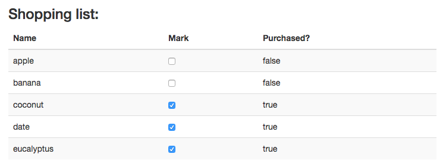
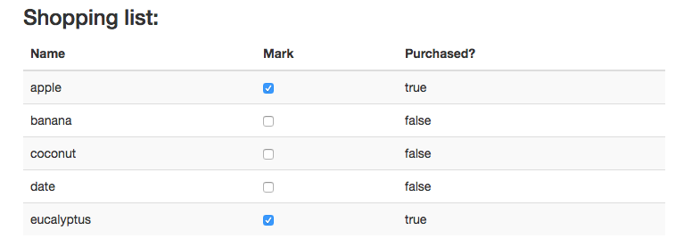

# Angular and Forms
* Angular is best suited for CRUD, and as a result it can do some really cool things with forms.
  
* For the moment we are only going to touch on one small example, later we will circle back and cover form validation in depth.
  
### Explicit Data Binding
* Explicit data binding is the direct mapping between an `ngModel` directive and some model value assigned in the controller.
  
* The following is an example of how Explicit Data binding can be combined with a checkbox to display existing state, as well as change state with two-way data-binding.
  
```html
<!DOCTYPE html>
<html ng-app="formApp">
<head>
  <title>Forms Ng</title>
</head>
  <link rel="stylesheet" type="text/css" href="bootstrap.min.css">
  <script src="angular.min.js"></script>
  <script type="text/javascript">
    var app = angular.module("formApp",[]);

    app.controller("formController", function($scope){
      $scope.shoppingList = [
        {name : "apple", purchased : false},
        {name : "banana", purchased : false},
        {name : "coconut", purchased : true},
        {name : "date", purchased : true},
        {name : "eucalyptus", purchased : true}
      ]
    });
  </script>
<body ng-controller="formController">
  <div class="container">
    <h3>Shopping list:</h3>
    <table class="table table-striped">
      <thead>
        <th>Name</th>
        <th>Mark</th>
        <th>Purchased?</th>
      </thead>
      <tbody>
        <tr ng-repeat="item in shoppingList">
          <td>{{item.name}}</td>
          <td><input type="checkbox" ng-model="item.purchased"/></td>
          <td>{{item.purchased}}</td>
        </tr>
      </tbody>
    </table>
  </div>
</body>
</html>
```
  
* The code above defines a checkbox as the second column in the table. This checkbox is assigned an `ngModel` attribute equal to `"item.purchased"`.
  
* When the page is loaded, Angular uses the "purchased" property to set the initial state of the checkbox:
  

  
* Now, by toggling one of the checkboxes, the model's "purchased" property will change:
  

  
#### Continue to [`ngClass` directive](9_ng_class.md)
