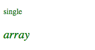
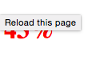

# `ngClass`
* The `ngClass` directive allows you to dynamically set CSS classes on HTML by databinding an expression that represents the classes to be added.
  
* `ngClass` can either add a single class, or a collection of classes (as an array). The following example illustrates both approaches:
  
```html
<!DOCTYPE html>
<html ng-app="myApp">
<head>
  <title>Class Ng</title>
  <!-- assume these styles -->
  <style type="text/css">
    .big {
      font-size: 24px;
    }

    .green {
      color: green;
    }

    .italic {
      font-style: italic;
    }
  </style>
  <script src="../../angular.min.js"></script>
  <script type="text/javascript">
    var app = angular.module('myApp', []);
    app.controller('classController', function($scope){
      $scope.class = "green";
      $scope.classes = ["big","green","italic"];
    });
  </script>
</head>
<body ng-controller="classController">
  <p ng-class="class">single</p>
  <p ng-class="classes">array</p>
</body>
</html>
```
  

  
* Additionally (and extremley usefully), you can also use the ternary operator to assign a class:
  
```html
<!DOCTYPE html>
<html ng-app="myApp">
<head>
  <title>Class Ng</title>
  <!-- assume these styles -->
  <style type="text/css">
    .green {
      color: green;
    }

    .red {
      color: red;
    }
  </style>
  <script src="../../angular.min.js"></script>
  <script type="text/javascript">
    var app = angular.module('myApp', []);
    app.controller('classController', function($scope){
      $scope.test = false;
      $scope.stylePassingGrade = $scope.test ? "green" : "red";
    });
  </script>
</head>
<body ng-controller="classController">
  <h1 ng-class="stylePassingGrade">43%</h1>
</body>
</html>
```
  

  
#### Continue to [introduction to AngularJS filters](_10_intro_filters.md)