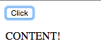

# `$compile()`
* When dynamically appending content to the DOM which includes AngularJS directives, Angular will not automatically evaluate it, this means that the expected functionality will not exist.
  * *this is because angular has already evaluated the document and annotated the markup as needed, for performance reasons it will not do this again automativally after loading the DOM*
  
* If the code you are appending to the DOM doesn't have any Angular, you won't need to comile it:
  
```html
<!DOCTYPE html>
<html ng-app="myApp">
<head>
  <title>Appendix A</title>
  <script src="../../angular.min.js"></script>
  <script type="text/javascript">
    var app = angular.module('myApp', []);
    app.directive('exDirective', function($compile){
      return {
        restrict : 'E',
        scope : {},
        template : "<button ng-click='click()'>Click</button>",
        link : function($scope,$element,$attr) {
          $scope.click = function() {
            var $p = "<p>CONTENT!</p>"
            $element.after($p);
          }
        }
      }
    })
  </script>
</head>
<body>
  <ex-directive></ex-directive>
</body>
</html>
```
  

  
* HOWEVER! If you do want to include Angular in the code you append, it won't be evaluated by default:
  
```html
<!DOCTYPE html>
<html ng-app="myApp">
<head>
  <title>Appendix A</title>
  <script src="../../angular.min.js"></script>
  <script type="text/javascript">
    var app = angular.module('myApp', []);
    app.directive('exDirective', function($compile){
      return {
        restrict : 'E',
        scope : {},
        template : "<button ng-click='click()'>Click</button>",
        link : function($scope,$element,$attr) {
          $scope.click = function() {
            $scope.showContent = false;

            var $p = "<p ng-show='showContent'>CONTENT!</p>"

            $element.after($p);
          }
        }
      }
    })
  </script>
</head>
<body>
  <ex-directive></ex-directive>
</body>
</html>
```
  

  
* Consider the example above:
  * The `showContent` property on the scope is set to false.
  * The `ngShow` directive should only display the paragraph tag if `showContent` evaluates to true...but it shows it anyway
  * This happens because the Angular isn't being evaluated.

* Luckily, if you do need Angular, you can force the HTML you append to be evaluated with the `$compile` service.
  
* `$compile` returns a link function which is used to bind a template to a scope.
  
* Here is a very simple example of how we can use `$compile` to bind a template to the scope in a directive.
  
```html
<!DOCTYPE html>
<html ng-app="myApp">
<head>
  <title>Appendix A</title>
  <script src="../../angular.min.js"></script>
  <script type="text/javascript">
    var app = angular.module('myApp', []);
    app.directive('exDirective', function($compile){
      return {
        restrict : 'E',
        scope : {},
        template : "<button ng-click='click()'>Click</button>",
        link : function($scope,$element,$attr) {
          $scope.click = function() {
            $scope.showContent = false;

            var $p = "<p ng-show='showContent'>CONTENT!</p>"

            var compiledParagraph = $compile($p)($scope);

            $element.after(compiledParagraph);
          }
        }
      }
    })
  </script>
</head>
<body>
  <ex-directive></ex-directive>
</body>
</html>
```
  
* In the above example we used the `$compile` the HTML before appending it, now, no matter how many times you click the button, the content will not be visible.
  