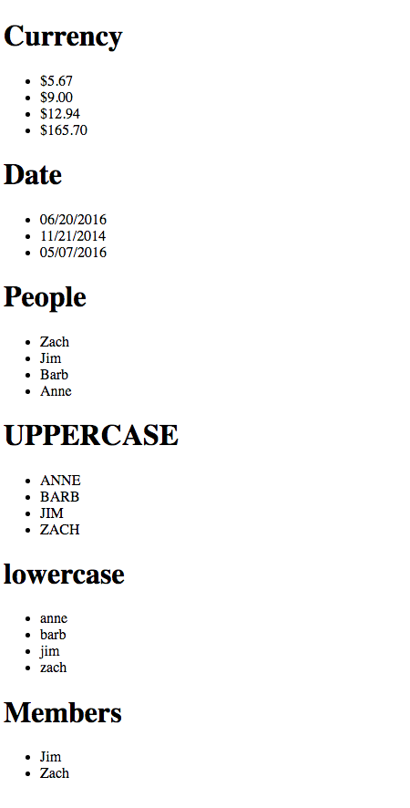

# Angular Filters
* Angular has incredibly powerful filters, some of which pair well with the `ngRepeat` directive.
  
* Filters do more than just filter content, they can also assist in sorting data, and transforming it.
  
* AngularJS comes with some built in filters for you to use (here are some of them):
  * `currency` : formats a number to some currency, applied to the value you wish to format as a currency
  * `date` : converts a date to some format
  * `filter` : which allows you to filter a subset of a collection based on some comparison. This comparator is an argument included after a colon.
  
```html
<!-- object is {name : "Jim", member: true} -->
<li ng-repeat="person in people | filter:{'member':true} | orderBy:'name'">
      {{person.name}}
</li>
```
  
  * `orderBy` : orders the elements in an array by an expression. Like `filter`, `orderBy` is piped onto the `ngRepeat` directive:
  
```html
<li ng-repeat="curr in currency | orderBy">
  {{curr | currency}}
</li>
```
  
  * `lowercase` : convert all text to lowercase
  * `uppercase` : convert all text to uppercase
  
* Below is an example of some of these filters:
  
```html
<!DOCTYPE html>
<html ng-app="filterApp">
<head>
  <title>Filter Ng</title>
  <script src="../../angular.min.js"></script>
  <script type="text/javascript">

  var app = angular.module('filterApp',[]);
  app.controller('filterController', function($scope){
    $scope.currency = [
      12.94,
      5.67,
      9,
      165.7
    ];
    $scope.dates = [
      1466437807931,
      1416635907931,
      1462636907931
    ];
    $scope.people = [
      {name : "Jim", member : true},
      {name : "Barb", member : false},
      {name : "Zach", member : true},
      {name : "Anne", member : false}
    ];
  })
    
  </script>
</head>
<body ng-controller="filterController">
<h1>Currency</h1>
  <ul>
    <li ng-repeat="curr in currency | orderBy">
      {{curr | currency}}
    </li>
  </ul>

  <h1>Date</h1>
  <ul>
    <li ng-repeat="date in dates">
      {{date | date : "MM/dd/yyyy"}}
    </li>
  </ul>

  <h1>People</h1>
  <ul>
    <li ng-repeat="person in people | orderBy:'name':'reverse'">
      {{person.name}}
    </li>
  </ul>

  <h1>UPPERCASE</h1>
  <ul>
    <li ng-repeat="person in people | orderBy:'name'">
      {{person.name | uppercase}}
    </li>
  </ul>

  <h1>lowercase</h1>
  <ul>
    <li ng-repeat="person in people | orderBy:'name'">
      {{person.name | lowercase}}
    </li>
  </ul>

  <h1>Members</h1>
  <ul>
    <li ng-repeat="person in people | filter:{'member':true} | orderBy:'name'">
      {{person.name}}
    </li>
  </ul>

</body>
</html>
```
  

  
#### Continue to [custom filters](_11_custom_filters.md)