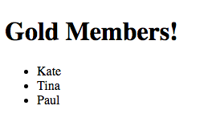

### Custom Filters
* If none of the default filters are precise enough to return the subset, or modification of data required, you can create your own.
  
* Creating a filter is similar to creating a Controller. To begin, use the `Module.filter('name', constructorFunction)` method. We will create a filter which displays users who are members and have gold status:
  
```html
<!DOCTYPE html>
<html ng-app="myApp">
<head>
  <title>Custom Filter Ng</title>
</head>
  <script src="../../angular.min.js"></script>
  <script type="text/javascript">
    var app = angular.module('myApp',[]);

    app.controller('filterController', function($scope){
      $scope.users = [
        {name : "Kate", member : true, status : "gold"},
        {name : "Andrew", member : false, status : "gold"},
        {name : "Cole", member : true, status : "silver"},
        {name : "Elizabeth", member : false, status : "gold"},
        {name : "Martin", member : true, status : "bronze"},
        {name : "Tina", member : true, status : "gold"},
        {name : "Paul", member : true, status : "gold"},
      ]
    });

    app.filter('memberStatusFilter', function(){
      return function(users, status) {
        var results = [];
        users.forEach(function(user){
          if (user.status === 'gold' && user.member) {
            results.push(user);
          }
        });
        return results;
      }
    });
  </script>
<body ng-controller="filterController">
  <h1>Gold Members!</h1>
  <ul>
    <li ng-repeat="user in users | memberStatusFilter">
      {{user.name}}
    </li>
  </ul>
</body>
</html>
```
  

  
* Let's break down what's happening:
  
```javascript
// 1. Register filter with module
app.filter('memberStatusFilter', function(){

  // 2. Return a function that will be used to sort collection
    // Argument passed to this function is the collection 
    // or element being filtered
  return function(users) {
    // Perform filtering/modifications
    var results = [];
    users.forEach(function(user){
      if (user.status === 'gold' && user.member) {
        results.push(user);
      }
    });
    // Return filtered/modified data
    return results;
  }
});
```
  
* The filter above is good, but restrictive...it only filters 'gold' members. We can further abstract this filter by passing it an argument with the status instead of hard coding it.
  
* Filters can be given arguments by passing additional values after a colon, for example:
  
```html
<li ng-repeat="user in users | memberStatusFilter:'gold'">
  {{user.name}}
</li>
```
  
* **NOTE**: above, we are passing a String as an argument, thus we need to enclose it within quotes. If this was a Boolean, Number, Array, or Object, we would forgo the inner quotation marks.
  
* Now let's refactor the filter to be more dynamic:
  
```html
<!DOCTYPE html>
<html ng-app="myApp">
<head>
  <title>Custom Filter Ng</title>
</head>
  <script src="../../angular.min.js"></script>
  <script type="text/javascript">
    var app = angular.module('myApp',[]);

    app.controller('filterController', function($scope){
      $scope.users = [
        {name : "Kate", member : true, status : "gold"},
        {name : "Andrew", member : false, status : "gold"},
        {name : "Cole", member : true, status : "silver"},
        {name : "Elizabeth", member : false, status : "gold"},
        {name : "Martin", member : true, status : "bronze"},
        {name : "Tina", member : true, status : "gold"},
        {name : "Paul", member : true, status : "gold"},
      ]
    });

    app.filter('memberStatusFilter', function(){
      return function(users, status) {
        var results = [];
        users.forEach(function(user){
          if (user.status === status && user.member) {
            results.push(user);
          }
        });
        return results;
      }
    })
  </script>
<body ng-controller="filterController">
  <h1>Gold Members!</h1>
  <ul>
    <li ng-repeat="user in users | memberStatusFilter:'gold'">
      {{user.name}}
    </li>
  </ul>
  <h1>Silver Members!</h1>
  <ul>
    <li ng-repeat="user in users | memberStatusFilter:'silver'">
      {{user.name}}
    </li>
  </ul>
</body>
</html>
```
  

  
* Now the above filter is more dynamic and is capable of displaying a subset of our data based on a specific use case. This keeps our code DRY!
  
### Continue to [lab 2](_12_lab2.md)