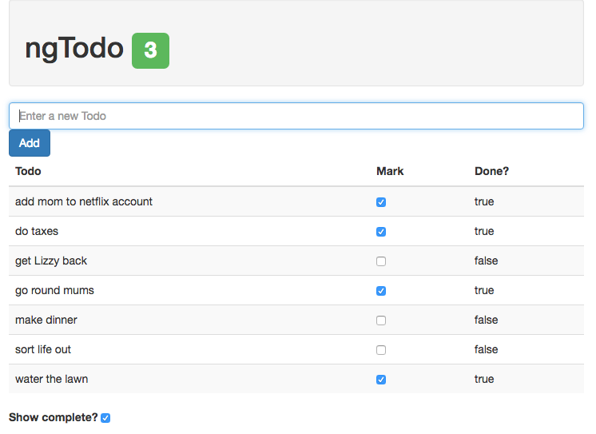

# Lab 2
* For this lab we will continue working on the todo application from the previous lab.
  
1: Add an `orderBy` filter to display the todos in alphabetical order by task name.  
  
2: In the currently blank second column header of the table add: "Mark".  
  
In the corresponding column's `<td>` elements, add a checkbox that corresponds to the `completed` property of the todo.  
  
3: Add a `filter` filter to the todos `ngRepeat` directive. Only display a todo if its `completed` property is `false`.  
  
Test this by clicking the check box. When the checkbox is checked, it should flip an incomplete todo to complete, and it should automatically be removed from the table.  
  
4: While it is useful to only see the incomplete todos, our users should still have the option to see the completed ones.  
  
Add a checkbox preceded by the text "Show completed tasks: " to the bottom of the page. This checkbox should be matched with a `showComplete` property on the scope (a boolean).  
  
5: Replace the `filter` filter in your `ngRepeat` directive with a custom filter. The custom filter should display a todo if it is incomplete (e.g. `completed === false`), OR, if `showComplete` is true.  
  
6: Now that we can display completed todos, you may have noticed that our label is inaccurate. The label lists the number of todos in the array...not the number of incomplete todos.  
  
Instead of using an expression checking the length of the `todos` array to display the number of todos, create a controller behavior which returns the number of incomplete todos in the array. Use this behavior to assign the number of todos to the label.  
  
7: Let's add some additional user feedback. If the number of incomplete todos is getting large, we should draw the users attention to that by changing the color of the label showing how many todos remain to accomplish.  
  
If there are more than 3 todos left, make the label yellow. 3 or less, green.  
  
**HINT**: Use the `ngClass` directive...a ternary operator might help too.  
  
When you've completed this lab, your application should look like this:
  

  
#### Continue to [introduction to custom directives](_13_intro_directives.md)
