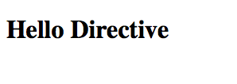

# Creating a Directive
* Directives are created from the angular Modules with the `Module.directive('name', constructorFunction)` method.
  
```html
<!DOCTYPE html>
<html>
<head ng-app="myApp">
  <title>Directive Ng</title>
  <script src="../../angular.min.js"></script>
  <script type="text/javascript">
  var app = angular.module('myApp', []);

  app.directive('myDirective', function(){

  });
  </script>
</head>
<body>

</body>
</html>
```
  
### "Hello Directive"

* To begin, let's create an extremely basic element directive which prints out a header containing "Hello Directive":
  
```html
<!DOCTYPE html>
<html>
<head ng-app="myApp">
  <title>Directive Ng</title>
  <script src="../../angular.min.js"></script>
  <script type="text/javascript">
    var app = angular.module('myApp', []);

    app.directive('myDirective', function(){
      return {
        restrict : 'E',
        template : '<h1>Hello Directive</h1>'
      }
    });
  </script>
</head>
<body ng-controller="productController">

  <my-directive></my-directive>

</body>
</html>
```
  

  
* The above directive constructor returns an object with two properties.
  * `restrict : 'E'` : indicates that this directive can only be used as an Element. If we wanted to use this as either an Element or an Attribute, we could have set this to 'EA'
  * `template : '<h1>Hello Directive</h1>` : designates the HTML template to render with this directive. As you can see, this syntax will quickly become cumbersome and require a large amount of String concatenation. (don't worry there is another way to handle templating for directives).
  
#### Continue to [isolating directive scope](_15_directive_scope.md)