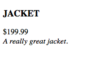
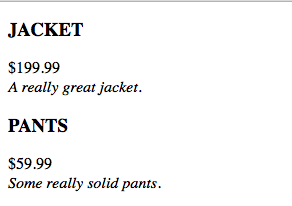

# Isolate Directive Scope

* At the moment, our directive isn't doing much. Let's create a controller see how directives be passed information from the `$scope`
  
```html
<!DOCTYPE html>
<html ng-app="myApp">
<head>
  <title>Directive Ng</title>
  <script src="../../angular.min.js"></script>
  <script type="text/javascript">
  var app = angular.module('myApp', []);

  app.controller('productController', function($scope){
    $scope.saleProduct = {
      name : "Jacket",
      price : 199.99,
      description : "A really great jacket."
    }
  });

  app.directive('productPanel', function(){
    return {
      restrict : 'E',
      templateUrl : "product.template.html",
      scope : {
        data : "=",
      },
      link : function($scope,$element,$attr){

      }
    }
  });


  </script>
</head>
<body ng-controller="productController">
  <product-panel data="saleProduct" color="red"></product-panel>
</body>
</html>
```
  

  
* The above directive introduces two new properties.
  * `templateUrl : "product.template.html"` : indicates that a file ("product.template.html") should be referenced to template the HTML. You can think of this value as being similar to a partial, but specific to this directive.
  
```html
<div>
  <h3>{{data.name | uppercase}}</h3>
  <div>{{data.price | currency}}</div>
  <div><em>{{data.description}}</em></div>
</div>
```
  
  * `scope  : { data : "=" }` : isolates the directives scope, preventing it from accidently updating the `$scope` value, or accessing the incorrect value. The 'data' attribute from the directive is passed a value (in this case a `$scope` property named 'saleProduct'). The scope then isolates this value into a local property named 'data' which is available to, and used in the template. The '=' indicates that we want the binding to be two-way. If you would prefer to use a one-way binding, you can substitute '@'.
  
* You might be starting to see how useful directives can be just for their compartmentalization of view partials.
  
* You can also combine directives with the `ngRepeat` directive:
  
```html
<!DOCTYPE html>
<html ng-app="myApp">
<head>
  <title>Directive Ng</title>
  <script src="../../angular.min.js"></script>
  <script type="text/javascript">
  var app = angular.module('myApp', []);

  app.controller('productController', function($scope){
    $scope.products = [{
      name : "Jacket",
      price : 199.99,
      description : "A really great jacket."
    },
    {
      name : "Pants",
      price : 59.99,
      description : "Some really solid pants."
    }];
  });

  app.directive('productPanel', function(){
    return {
      restrict : 'E',
      templateUrl : "product.template.html",
      scope : {
        data : "=",
      }
    }
  });


  </script>
</head>
<body ng-controller="productController">
  <div ng-repeat="product in products">
    <product-panel data="product" color="red"></product-panel>
  </div>
</body>
</html>
```
  
```html
<div>
  <h3>{{data.name | uppercase}}</h3>
  <div>{{data.price | currency}}</div>
  <div><em>{{data.description}}</em></div>
</div>
```
  

  
#### Continue to [directive link functions and jqlite](_16_directive_link.md)