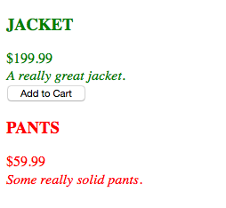

# Directive Link Functions & jqlite

* We will cover one more directive property for now, the 'link' property.
  
* `link` is a function that has access to the current scope, the element on which the directive was declared (or the element itself), as well as the element's attributes and some other things.
  
```javascript
  app.directive('productPanel', function(){
    return {
      restrict : 'E',
      templateUrl : "product.template.html",
      scope : {
        data : "=",
      },
      link : function($scope, $element, $attr){
        // some logic
      }
    }
  });
```
  
* Consider this example:
  
```html
<!DOCTYPE html>
<html ng-app="myApp">
<head>
  <title>Directive Ng</title>
  <script src="../../angular.min.js"></script>
  <script type="text/javascript">
  var app = angular.module('myApp', []);

  app.controller('productController', function($scope){
    $scope.products = [{
      name : "Jacket",
      price : 199.99,
      description : "A really great jacket.",
      available : true
    },
    {
      name : "Pants",
      price : 59.99,
      description : "Some really solid pants.",
      available : false
    }];

    $scope.loggedIn = true;
  });

  app.directive('productPanel', function(){
    return {
      restrict : 'E',
      templateUrl : "product.template.html",
      scope : {
        data : "=",
        user : "="
      },
      link : function($scope,$element,$attr){
        if ($attr.available === 'true') {
          $element.css('color', 'green');
        } else {
          $element.css('color', 'red');
        }
        if (($attr.available === 'true') && $scope.user) { 
          var btn = "<button>Add to Cart</button>"
          $element.after().append(btn);
        }
      }
    }
  });


  </script>
</head>
<body ng-controller="productController">
  <div ng-repeat="product in products">
    <product-panel data="product" available="{{product.available}}" user="loggedIn"></product-panel>
  </div>
</body>
</html>
```
  
```html
<!-- product.template.html -->
<div>
  <h3>{{data.name | uppercase}}</h3>
  <div>{{data.price | currency}}</div>
  <div><em>{{data.description}}</em></div>
</div>
```
  

  
* Let's unpack what just happened.
  
  * `$scope` refers to the isolated scope of the directive (not the shared scope between the view and the controller)
  * `$element` is the directive element in markup
  * `$attr` is an object, it contains all of the attributes and their values.
  
* Probably the most unexpected occurence was the sudden use of syntax similar to jQuery.
  
* AngularJS contains a slimmed down library similar to jQuery called jqlite. The `$element` argument in the link function is an active DOM element, and can be manipulated with jqlite.
  
* **Fun Fact**: If you need all of jQuery, you can include it in your project before importing AngularJS, and Angular will default to jQuery instead of jqlite.
  
```javascript
app.directive('productPanel', function(){
  return {
    restrict : 'E',
    templateUrl : "product.template.html",
    scope : {
      data : "=",
      user : "=" // add reference to the user attribute in scope
    },
    link : function($scope,$element,$attr){
      if ($attr.available === 'true') {
        $element.css('color', 'green');
      } else {
        $element.css('color', 'red');
      }

      if (($attr.available === 'true') && $scope.user) { 
        var btn = "<button>Add to Cart</button>"
        $element.after().append(btn);
      }
    }
  }
});
```
  
#### Continue to [lab 3](_17_lab3.md)