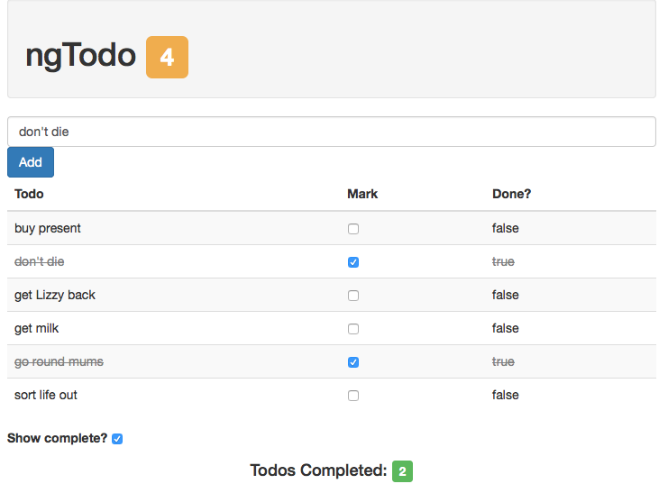

# Lab 3
* This lab will continue to build upon the Todo application from the previous labs. We will be refactoring the previous work, as well as add new features using directives.
  
1: You are going to refactor your table to display todos with an attribute directive.  
  
Create a 'todo.template.html' file to serve as a template.  
  
Create a new directive named 'todoRow'.  
  
2: Add the 'todoRow' directive to the table row, move the appropriate code into the 'todo.template.html' file.  
  
3: In the 'todoRow' link funciton, if the todo is completed, strike it through, and change the text to a light gray.  
  
4: With your 'todoRow' directive complete and working, let's add a footer to the project which counts the number of completed todos.  
  
Create a new element directive called 'myFooter', and a template named 'footer.template.html'  
  
5: The 'myFooter' directive will be passed the todos array from the todosController. In your link function create a method on the directives scope called 'completedTodos'. This method should determine how many of the todos are complete, and return that number.  
  
6: Bind the 'completeTodos' method in your footer to display the number of completed todos.  
  
*When the lab is complete is should look like this:*  
  

  
#### Continue to [introduction to angular services](_18_intro_services.md)