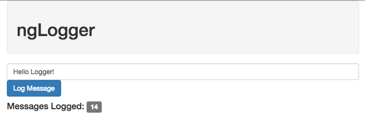
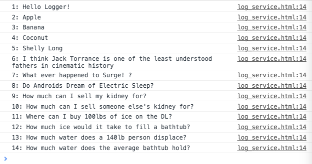

### Using a service
* Now that we've created a service to log messages, we need to inject it into a controller to use it:
  
```javascript
app.controller('logController', function($scope, logService) {

});
```
  
* The same way that we injected the built in `$scope` service to this controller, we can also inject our own service by name. Now that we've injected the `logService` dependency, we can use the behavior it provides.
  
```javascript
app.factory('logService', function(){
  var messageCount = 0;

  var log = function(message) {
    console.log(++messageCount + ": " + message);
  };

  var getMessageCount = function(){
    return messageCount;
  };

  return {
    log : log,
    getMessageCount : getMessageCount
  };
});

// 1
app.controller('logController', function($scope, logService) {
  // 2
  $scope.message = "";

  // 3
  $scope.totalMessages = logService.getMessageCount();

  // 4
  $scope.logMessage = function(message){
    logService.log(message);
    
    $scope.totalMessages = logService.getMessageCount();
  };

});
```
  
1: Create a controller on the module, inject the `logService` dependency.  
  
2: Declare a `message` property on the `$scope` and initialize it to an empty String.  
  
3: Declare a `totalMessages` property on the `$scope` and initialize it to the number of messages from the `logService`  
  
4: Create a behavior on the scope which uses the `logService` to log a message, and then updates the `totalMessages` property.  
  

  

  
* *Complete code from the above example*:
  
```html
<!DOCTYPE html>
<html ng-app="logApp">
<head>
  <title>Log Ng</title>
  <link rel="stylesheet" type="text/css" href="../../bootstrap.min.css">
  <script src="../../angular.min.js"></script>
  <script type="text/javascript">
    var app = angular.module('logApp',[]);

    app.factory('logService', function(){
      var messageCount = 0;

      var log = function(message) {
        console.log(++messageCount + ": " + message);
      };

      var getMessageCount = function(){
        return messageCount;
      }

      return {
        log : log,
        getMessageCount : getMessageCount
      };
    });

    app.controller('logController', function($scope, logService) {
      $scope.message = "";
      $scope.totalMessages = logService.getMessageCount();

      $scope.logMessage = function(message){
        logService.log(message);
        $scope.totalMessages = logService.getMessageCount();
      };

    });

  </script>
</head>
<body ng-controller="logController">
  <div class="container">
    <div class="well">
      <h1>ngLogger</h1>
    </div>
    <div class="row">
      <div class="col-md-8">
        <input class="form-control" type="text" ng-model="message" />
      </div>
      <div class="col-md-2">
        <button class="btn btn-primary" ng-click="logMessage(message)">
          Log Message
        </button>
      </div>
    </div>
    <div>
      <h4>Messages Logged: 
        <span class="label label-default">
          {{totalMessages}}
        </span>
      </h4>
    </div>
  </div>
</body>
</html>
```
  
#### Continue to [lab 4](_20_lab4.md)