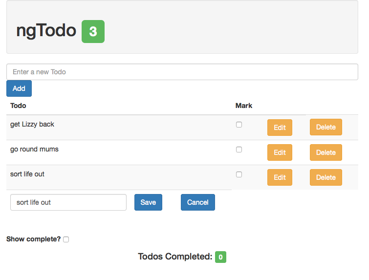

# Lab 4
* This lab will continue to build upon the Todo application from the previous labs. We will be refactoring the previous work, as well as add new features using services.
  
* We will be implementing CRUD with our service, and removing the role of maintaining the state of our data from the Controller. This follows the best practive of the separation of concerns while conforming to the MVC pattern. **Spoiler**: Soon we are going to hook this up to an API, you don't want all of the resource specific networking logic in your controller.
  
**1**: Create a `factory` service named 'todoService'. Be sure to inject it into your todosController.  
  
**2**: Create a todos variable in the service, and initialize it with the todos array from your controller (remove the array from the controller).  
  
**3**: Create a 'getTodos' function in your service which returns the todos. Expose this method in the returned object.  
  
**4**: In your 'todosController', use the service's 'getTodos' method to populate the 'todos' property on the $scope.  
  
Test your app, it should work exactly as it did before.  
  
**5**: Now that we can retrieve all of the todos, let's make sure that we can identify them uniquely. Add an 'id' property to each of your todos (just add the property to the object).  
  
In your service, create a variable named 'todosCreated' and initialize it to the number of todos you currently have in your array.  
  
We don't have a need for a 'show' route which only retrieves a single todo at this time, but these ids will come in handy when we are doing things like updating and deleting todos later.  
  
**6**: Add create todo logic to your service and controller. In you service, add a 'createTodo' function that takes a todo as an argument. The function should iterate the 'todosCreated' and use the variable to assign an id property to the todo before pushing it into the todos array.  
  
Update your `$scope.addTodo` behavior in your controller. Now it should use the services 'createTodo' function.  
  
**7**: Now that we can create, lets implement delete. To accomplish this, we will need to update the `todoRow` directive and the 'todo.template.html' we created earlier, in addition to the controller and service.  
  
To begin, add a 'Delete' button to the 'todo.template.html'. You can either add a new column, or replace the 'Done?' column. Add an `ngClick` directive that will call a 'remove' function and pass it the todo as an argument.  
  
Now we need to create a 'remove' behavior in the controller, and make it accessible by the directive. First, create a 'remove' behavior in the controller. For now, just have the funciton `console.log("in remove")`.  
  
The same way we passed the todo to the directive with an attribute earlier, let's pass the remove behavior from the controller to the directive.  
  
Now, when you click the 'Delete' button, it should log 'in remove' to the console.  
  
Once you've got your directive using the controller behavior, create a 'deleteTodo' method in your service. You can either lookup the todo to delete by it's id, or you can use the `splice()` array method to remove the todo.  
  
Be sure to call this method from your controller's 'remove' behavior. Test to make sure it works.  
  
**8**: Last but not least we need to add update functionality. In order to do so, we need to explore some additional AngularJS functionality. Reference:
  * [Appendix A](Appendix_A.md) to use `$compile` to dynamically add a form with Angular functionality
  * [Appendix B](Appendix_B.md) to make a copy of a model so you don't accidently update the original with 2-way data binding
  * [Appendix C](Appendix_C.md) to learn how to dynamically remove an element.
  
For the sake of this lab, you want to dynamically create an edit form below the todo you selected to edit (by pressing the edit button). This form will have a text input which displays the current name of the todo, a save button and a cancel button. **HINT**: Use `$compile`  
  
When the save button is pressed, the updated todo should be sent to an 'updateTodo' method on the service through an 'update' behavior on the controller. In order for the directive to do some clean up, we will have it pass through the directives 'link', invoking a 'save' method which removes the edit form. **HINT**: Use `$element.remove()`  
  
When the cancel button is pressed, the form should be removed. **HINT**: Use `$element.remove()`  
  
This logic is a bit confusing, here is an image of what this updated functionality will look like:  

  
  
#### Continue to [how to compartmentalize AngularJS into files](_21_refactor.md)

