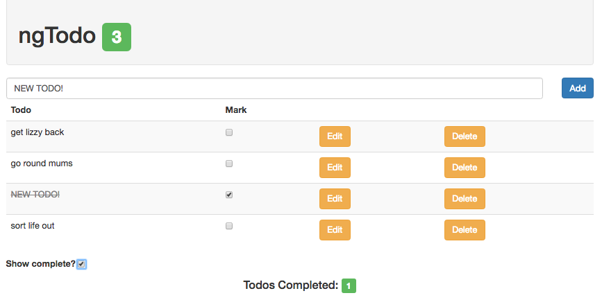

# Lab 8: Persisting Data with $http
* This lab will continue to build upon the Todo application from the previous labs. We will be refactoring the previous work. 
  
* We will be refactoring the methods in our 'todoService' to use $http and connect to the API we built in the previous lab. Next we will use callback functions in our 'todosController' to update the DOM with the results.
  
1: In 'todoService' you no longer need a variable to track the number of todos created, nor will you need a variable to hold a static array of todos.  
  
Update your 'getTodos' method, use $http and have it return a promise for all of your todos.  
  
2: In 'todosController',  the `$scope.todos` as an empty array. Next, create a `$scope.loadData` behavior which calls the 'todoService.getTodos()' method and populates the todos array.  
  
Now invke the `loadData` behavior to populate `$scope.todos` when the controller loads.  
  
3: In 'todoService' remove the logic inside of your 'createTodo' method. Replace it with an $http 'POST' with content type json, sending the todo it was passed.  
  
4: In 'todosController', chain a `.then(callback)` onto your 'todoService.createTodo({})' using the `$scope.loadData()` behavior to refresh the DOM.  
  
5: Replace your 'todoService' 'deleteTodo' method with an $http method. In 'todosController' refresh the DOM with the callback.  
  
6: Replace your 'todoService' 'updateTodo' method with an $http method. In 'todosController' refresh the DOM with the callback.  
  
*You are done with the previous 6 steps when everything works precisely the same as it did previously*  
  
7: Last but not least, we never added functionality to the checkbox to update the completion state of a todo in the database.  
  
For our usecase, we want the user to be able to both mark a todo completed AND delete it entirely.  
  
Look over [Appendix D](Appendix_D.md) to see how you could use the `ngChange` directive to trigger a controller behavior and update the completed value.  
  
**The final, complete application should look like this after refreshing the page**  
  

  
#### Continue to [summary](_28_summary.md)