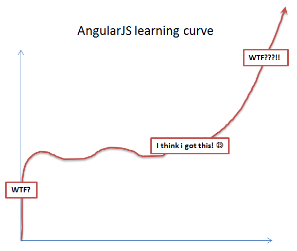

# What is Angular?

  
> AngularJS is a structural framework for dynamic web apps. It lets you use HTML as your template language and lets you extend HTML's syntax to express your application's components clearly and succinctly. Angular's data binding and dependency injection eliminate much of the code you would otherwise have to write. And it all happens within the browser, making it an ideal partner with any server technology.
> ~*AngularJS Docs*
  
* AngularJS started as an internal project at Google, but has since been open sourced.
  
* In short, it is an extremely high level of abstraction that provides us the ability to perform complex DOM manipulation with ease.
  

#### Continue to [setup](3_setup.md)
