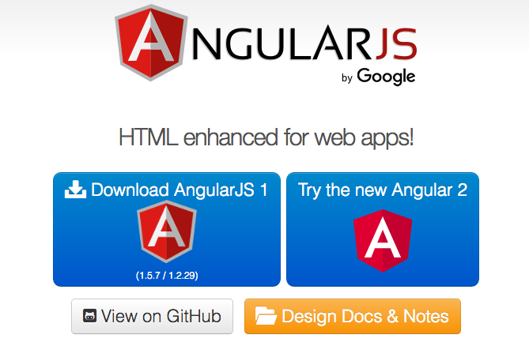

# Setup
* Setting up AngularJS is very easy.
  
* Go to [AngularJS.org]
  
* Here you will see two large blue buttons. The first, will launch a modal allowing you to download a version of 'AngularJS 1'. The second prompts you to 'Try the new Angular 2'. We will be using Angular 1, so click on that button.
  

  
* The resulting modal (pictured below), shows various download options. The pre-selected defaults ("Branch" : 1.5 x (stable), "Build" : "Minified") will do for now, click the 'Download' button.
  

  
* Now you have Angular downloaded in your 'Downloads' directory (angular.min.js). 
  
#### Continue to ['Hello Angular'](4_hello_ng.md)

[ng]:https://angularjs.org/