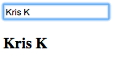

# Live Bindings
* AngularJS's greatest strength is the simplicity with which it allows us to perform various tasks.
  
* One way AngularJS makes life easy is data binding with the `ngModel` directive.
  
* **NOTE**: Angular Directives are camelCased, but HTML does not respect camelCase, as such, when a directive is used in HTML it is instead hyphenated (e.g `ng-model`). Thus, Angular Directives are correctly referred to by their camelCased name.
  
* `ngModel` binds an `input`, `select` or `textarea` to a property on the `scope` (which may be created, or at least exposed by this directive).
  
* **What does it mean to *bind* an element?**
  * Binding (or databinding) is Angular's automatic synchronization of data between the model and view components. This implementation is two-way-databinding, meaning that when the model changes so does the view and vice versa.
    * **Q**: *What does* ***THAT*** *mean?*
    * **A**: You don't have to write logic to update content somewhere on your view...Angular will handle it for you.
  
 
  
*...confusing theoretical explanation is confusing...*

### Example
* Consider the following (and run it in a browser).
  
```html
<!DOCTYPE html>
<html ng-app>
<head>
  <title>Live Bind Ng</title>
  <script src="../angular.min.js"></script>
</head>
<body>
  <input type="text" ng-model="name" />
  <h3>{{name}}</h3>
</body>
</html>
```

1: We've bootstrapped the angular application using the `ngApp` directive  
  
2: Created an `<input>` element and added a `ngModel="name"` directive, assigning a model named "name" to the `scope` object.  
  
3: In an `<h3>` element we've added a binding and added the variable `name` inside of it.  
  
* At the moment, `name` is `undefined`, as a result nothing appears in the browser beneath the input when we run this code.
  
* Now, type your name into the input...you should see the characters print out in the `<h3>` with each keystroke.
  

  
* As you can see, Angular directives are immensely powerful out of the box.

#### Continue to [more examples of directives](7_more_directives.md)