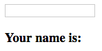

# More Directives
* Some Angular directives simplify, or outright replace JavaScript and jQuery methods.
  
* Angular is written in JavaScript, and relies heavily upon some of the jQuery libraries DOM manipulation methods...so much so in fact that Angular contains a paired down version of jQuery called jqlite. The benefit of jqlite is that you don't have to include jQuery in your projects (although, if you do include it, Angular will make use of it instead of jqlite).
  
### `ngShow`
* `ngShow` has similar functionality to jQuery's `.toggle()`.
  
* `ngShow` is given some expression to evaluate, and will either make an element visible or invisible (**NOTE**: it accomplishes this by assigning the element a class: `ng-hide`).
  
* Consider the following modification of our live binding example:
  
```html
<!DOCTYPE html>
<html ng-app>
<head>
  <title>Show Ng</title>
  <script src="js/angular.min.js"></script>
</head>
<body>
  <input type="text" ng-model="name" />
  <h3>Your name is: {{name}}</h3>
</body>
</html>
```
  
* When this html is loaded in the browser "Your name is:" will be visible even though there won't be any value for `{{name}}`.
  

  
* Obviously this is unacceptable...we only want this text to appear when there is some value for name.
  
* Apply `ngShow` as has been done in the following example: 
  
```html
<!DOCTYPE html>
<html ng-app>
<head>
  <title>Show Ng</title>
  <script src="../angular.min.js"></script>
</head>
<body>
  <input type="text" ng-model="name" />
  <h3 ng-show="name">Your name is: {{name}}</h3>
</body>
</html>
```
  
* Above, `ng-show="name"` will be "falsey" (`""`) until something is typed into the input, at which time it will become "truthy" and the `<h3>` content will display.
  
* `ngShow` can be used as above to evaluate model's in the `scope`, or to evaluate literals and expressions e.g.:
  
```html
<p ng-show="true">Text</p>
<!-- will be visible, true is true -->

<p ng-show="false">Text</p>
<!-- will be invisible, false is false -->

<p ng-show="1 == 1">Text</p>
<!-- will be visible, 1 == 1 is true -->

<p ng-show="1 == 2">Text</p>
<!-- will be invisible, 1 == 2 is false -->
```
  
### `ngClick`
* Angular replaces click events in vanilla JavaScript and jQuery with the `ngClick` directive.
  
* When `ngClick` is attributed to an element, it will listen for click events.
  
* `ngClick` is assigned to an action. This could be a function to call with some data, or it could simply reassign a value.
  
* Consider the following modifications to our live binding example:
  
```html
<!DOCTYPE html>
<html ng-app>
<head>
  <title>Click Ng</title>
  <script src="../angular.min.js"></script>
</head>
<body>
  <div>
    <button ng-click="name = ''">Clear Name</button>
    <input type="text" ng-model="name" />
    <h3 ng-show="name">Your name is: {{name}}</h3>
  </div>
</body>
</html>
```
  
* In the example above, when the button "Clear Name" is clicked, the "name" model will be reset to `""`. As an empty string (which is "falsey").
  
* This assignment is a simple example, but illustrates that `ngClick` has access to the models in the `scope` object by name. We will be using `ngClick` much more later.
  
